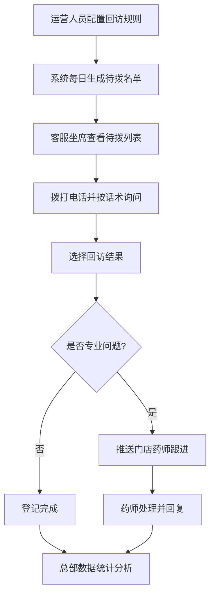

## 1. 产品概述

连锁DTP药房客服中心自动回访服务系统，专门承接各门店会员复购提醒、停药风险预警和满意度回访。通过自动化规则引擎生成每日待拨名单，客服完成回访后登记结果，异常问题自动流转至门店药师跟进，总部实时监控各门店回访完成率与异常集中点。

- 解决问题：人工回访效率低、规则不统一、异常问题遗漏、总部数据缺失
- 目标用户：总部运营人员、客服中心坐席、门店药师、总部管理层
- 产品价值：提升会员复购率、降低停药风险、统一服务标准、数据驱动运营

## 2. 核心功能

### 2.1 用户角色

| 角色 | 核心权限 |
|------|----------|
| 总部运营 | 设置回访规则、查看总部数据看板、管理门店配置 |
| 客服坐席 | 查看待拨名单、拨打回访电话、登记回访结果 |
| 门店药师 | 查看推送的专业问题、处理跟进记录、查看本店回访数据 |
| 总部管理层 | 查看全部门店回访完成率、异常集中点分析、趋势报表 |

### 2.2 功能模块

1. **回访规则窗口**：规则列表、新增/编辑规则、规则启停、按药品类别配置
2. **待拨名单窗口**：每日待拨列表、患者信息卡片、话术重点提示、筛选搜索、拨打状态追踪
3. **结果登记窗口**：回访结果选择、患者原话录入、专业问题推送药师、附件上传
4. **总部数据看板**：门店完成率排行、异常类型分布、趋势图表、停药风险预警

### 2.3 页面详情

| 页面名称 | 模块名称 | 功能描述 |
|-----------|-------------|---------------------|
| 回访规则 | 规则列表 | 展示所有规则，支持筛选、启停、编辑、删除 |
| 回访规则 | 规则表单 | 配置药品类别、触发条件（天数/事件）、话术模板、优先级 |
| 待拨名单 | 名单列表 | 展示当日待回访患者，含门店、药师、上次购药、话术重点 |
| 待拨名单 | 筛选搜索 | 按门店、药师、规则类型、拨打状态筛选 |
| 待拨名单 | 详情面板 | 患者历史回访记录、购药明细、关联规则详情 |
| 结果登记 | 结果选择 | 已接通/无人接听/需药师跟进/已自行停药/号码错误等 |
| 结果登记 | 原话录入 | 富文本记录患者原话，支持快速标签 |
| 结果登记 | 药师推送 | 标记专业问题后自动推送至对应门店药师，附备注 |
| 数据看板 | 完成率统计 | 各门店回访完成率排行，柱状图展示 |
| 数据看板 | 异常分析 | 异常类型饼图、停药风险热力图、趋势折线图 |
| 数据看板 | 药师跟进 | 待处理专业问题列表、处理时效统计 |

## 3. 核心流程

运营人员先在回访规则窗口配置药品类别对应的回访触发条件与话术模板。系统每日凌晨根据规则扫描会员购药记录，自动生成当日待拨名单。客服坐席登录后按优先级拨打，接通后根据话术重点询问，完成后选择回访结果并录入患者原话。若涉及药理问题或异常情况（如自行停药、严重不良反应），系统自动推送至所属门店药师处理。总部管理层通过数据看板实时监控各门店执行情况，识别异常集中点并优化运营策略。

## 4. 用户界面设计

### 4.1 设计风格

- 主色调：专业医疗蓝（#1E5FA8）搭配暖白背景，辅以信任绿（#2E8B57）和警示橙（#E67E22）
- 辅助色：停药风险用警示红（#E74C3C），已完成用成功绿（#27AE60）
- 按钮风格：圆角8px，主按钮实心蓝，次按钮描边蓝，危险按钮橙红色
- 字体：标题用思源黑体 Bold，正文用思源宋体 Regular，数据用 JetBrains Mono
- 布局风格：三栏式工作台（左侧导航+中间主内容+右侧详情抽屉），卡片化信息展示
- 图标风格：线性图标（2px线宽），状态用彩色圆点徽章

### 4.2 页面设计概述

| 页面名称 | 模块名称 | UI元素 |
|-----------|-------------|-------------|
| 回访规则 | 规则列表 | 表格布局，状态开关，优先级标签，悬停显示操作按钮 |
| 回访规则 | 规则表单 | 分组卡片式表单，药品类别多选，触发条件滑块，话术编辑器 |
| 待拨名单 | 名单列表 | 优先级色条卡片，头像+姓名+标签组，话术重点高亮卡片 |
| 待拨名单 | 详情抽屉 | 时间线式历史记录，购药明细表格，关联规则说明 |
| 结果登记 | 结果弹窗 | 单选按钮组（大尺寸卡片），快速标签云，文本域 |
| 结果登记 | 推送表单 | 药师下拉选择，紧急程度滑块，问题描述自动回填 |
| 数据看板 | 统计卡片 | 大数字+环比箭头，渐变背景卡片，悬停微动效 |
| 数据看板 | 图表区 | ECharts柱状图+饼图+折线图组合，可切换时间维度 |

### 4.3 响应式设计

- Desktop-first，最小支持宽度1366px
- 待拨名单卡片在平板端变为两列，手机端单列
- 右侧详情抽屉在小屏幕变为底部弹出面板
- 表格在移动端转换为卡片列表展示
