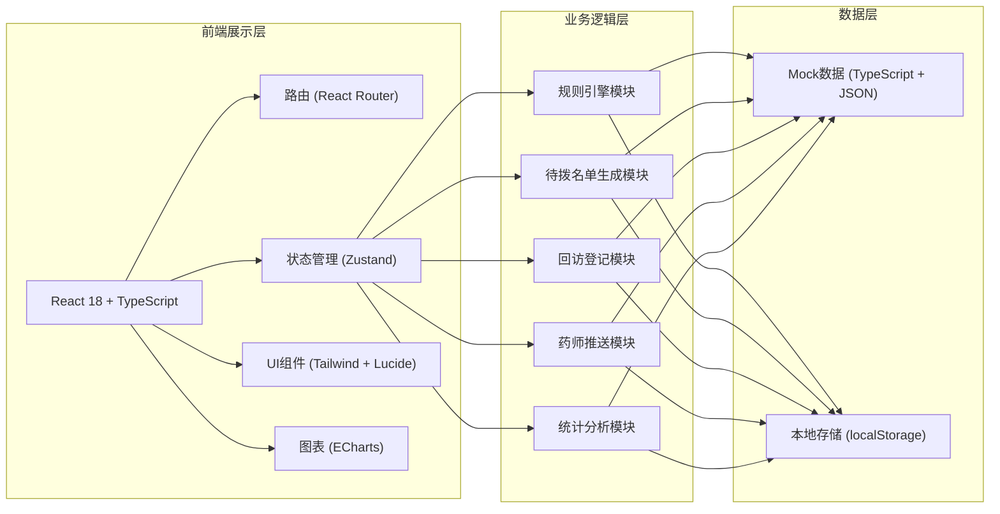
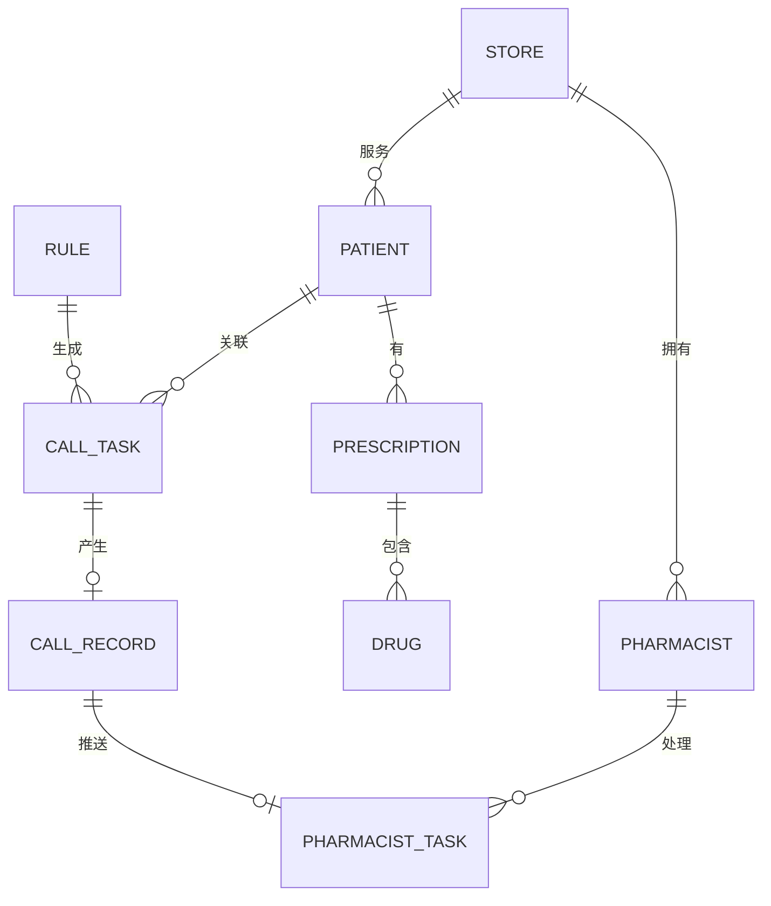

## 1. 架构设计



## 2. 技术描述

- 前端框架：React@18.2 + TypeScript@5
- 构建工具：Vite@5
- 样式方案：TailwindCSS@3.4
- 路由管理：React Router@6
- 状态管理：Zustand@4
- UI图标：Lucide React
- 图表组件：ECharts@5
- 日期处理：dayjs
- 后端：无后端，使用Mock数据 + localStorage持久化

## 3. 路由定义

| 路由 | 页面 | 功能说明 |
|------|------|----------|
| / | 数据看板 | 首页展示总部数据看板，完成率、异常分析、趋势 |
| /rules | 回访规则 | 规则列表、新增/编辑/启停规则 |
| /rules/new | 新增规则 | 创建新回访规则表单 |
| /rules/:id | 编辑规则 | 编辑指定回访规则 |
| /call-list | 待拨名单 | 当日待回访列表、筛选搜索、拨打操作 |
| /call-list/:id | 患者详情 | 患者信息、历史记录、购药明细 |
| /register/:id | 结果登记 | 回访结果选择、原话录入、药师推送 |
| /pharmacist | 药师工作台 | 待处理问题列表、跟进处理 |

## 4. 数据模型

### 4.1 实体关系图



### 4.2 数据结构定义

```typescript
// 门店
interface Store {
  id: string;
  name: string;
  address: string;
  manager: string;
  phone: string;
}

// 药师
interface Pharmacist {
  id: string;
  name: string;
  storeId: string;
  title: string; // 主管药师/执业药师/药师
  phone: string;
  avatar?: string;
}

// 患者
interface Patient {
  id: string;
  name: string;
  gender: '男' | '女';
  age: number;
  phone: string;
  storeId: string;
  pharmacistId: string;
  memberLevel: '普通' | '银卡' | '金卡' | '钻石';
  tags: string[];
  lastPurchaseDate: string;
  totalPurchaseAmount: number;
}

// 药品类别
type DrugCategory = 
  | '抗肿瘤靶向药'
  | '自身免疫抑制剂'
  | '冷链生物制剂'
  | '抗病毒药物'
  | '心血管慢病药'
  | '糖尿病用药'
  | '罕见病特效药';

// 回访规则
interface Rule {
  id: string;
  name: string;
  drugCategories: DrugCategory[];
  triggerType: 'days_after_purchase' | 'day_after_arrival' | 'days_after_first_purchase';
  triggerValue: number; // 天数
  priority: 'high' | 'medium' | 'low';
  scriptTemplate: string; // 话术模板
  keyPoints: string[]; // 话术重点
  enabled: boolean;
  createdAt: string;
  updatedAt: string;
}

// 回访任务（待拨名单）
interface CallTask {
  id: string;
  patientId: string;
  ruleId: string;
  storeId: string;
  pharmacistId: string;
  scheduledDate: string;
  priority: 'high' | 'medium' | 'low';
  status: 'pending' | 'calling' | 'completed' | 'failed';
  keyPoints: string[];
  lastDrugName: string;
  lastPurchaseDate: string;
  callCount: number;
}

// 回访结果类型
type CallResult = 
  | 'connected' // 已接通
  | 'no_answer' // 无人接听
  | 'pharmacist_followup' // 需药师跟进
  | 'self_discontinued' // 已自行停药
  | 'wrong_number' // 号码错误
  | 'refused' // 拒绝回访
  | 'appointment' // 预约回访
  | 'purchased' // 已复购

// 回访记录
interface CallRecord {
  id: string;
  taskId: string;
  patientId: string;
  result: CallResult;
  patientQuote: string; // 患者原话
  tags: string[];
  needPharmacistFollowup: boolean;
  pharmacistFollowupReason?: string;
  appointmentTime?: string;
  callDuration: number; // 秒
  createdAt: string;
  operatorId: string;
  operatorName: string;
}

// 药师跟进任务
interface PharmacistTask {
  id: string;
  callRecordId: string;
  patientId: string;
  pharmacistId: string;
  storeId: string;
  reason: string;
  priority: 'urgent' | 'normal' | 'low';
  status: 'pending' | 'processing' | 'completed';
  note?: string;
  handleResult?: string;
  createdAt: string;
  handledAt?: string;
}

// 统计数据
interface DashboardStats {
  totalTasks: number;
  completedTasks: number;
  completionRate: number;
  pendingPharmacistTasks: number;
  selfDiscontinuedCount: number;
  averageCallDuration: number;
  storeCompletionRates: { storeId: string; storeName: string; rate: number; total: number; completed: number }[];
  exceptionDistribution: { type: string; count: number; percentage: number }[];
  dailyTrend: { date: string; tasks: number; completed: number }[];
}
```

## 5. 项目目录结构

```
src/
├── components/          # 通用组件
│   ├── Layout/         # 布局组件（导航、侧边栏）
│   ├── Cards/          # 卡片组件
│   ├── Forms/          # 表单组件
│   ├── Tables/         # 表格组件
│   ├── Charts/         # 图表组件
│   ├── Modals/         # 弹窗组件
│   └── Badges/         # 标签徽章
├── pages/              # 页面组件
│   ├── Dashboard/      # 数据看板
│   ├── Rules/          # 回访规则
│   ├── CallList/       # 待拨名单
│   ├── Register/       # 结果登记
│   └── Pharmacist/     # 药师工作台
├── store/              # Zustand状态管理
│   ├── rulesStore.ts
│   ├── callTaskStore.ts
│   ├── callRecordStore.ts
│   ├── pharmacistStore.ts
│   └── dashboardStore.ts
├── data/               # Mock数据
│   ├── stores.ts
│   ├── pharmacists.ts
│   ├── patients.ts
│   ├── rules.ts
│   ├── callTasks.ts
│   └── callRecords.ts
├── types/              # TypeScript类型定义
│   └── index.ts
├── utils/              # 工具函数
│   ├── date.ts
│   ├── format.ts
│   └── storage.ts
├── hooks/              # 自定义Hooks
├── router/             # 路由配置
├── App.tsx
├── main.tsx
└── index.css
```
